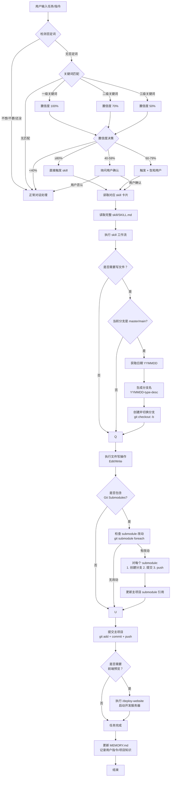
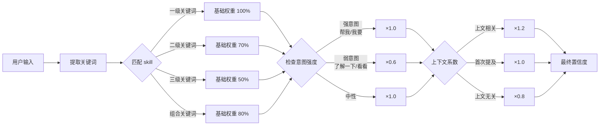
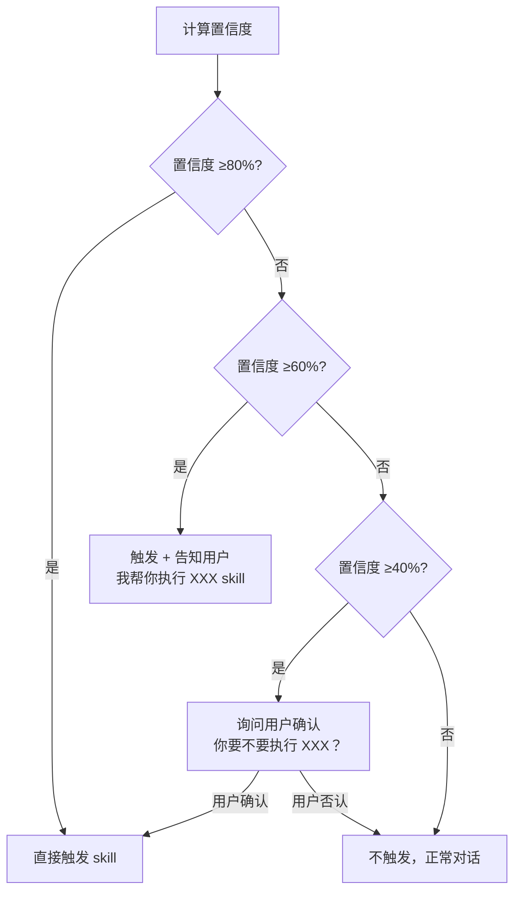
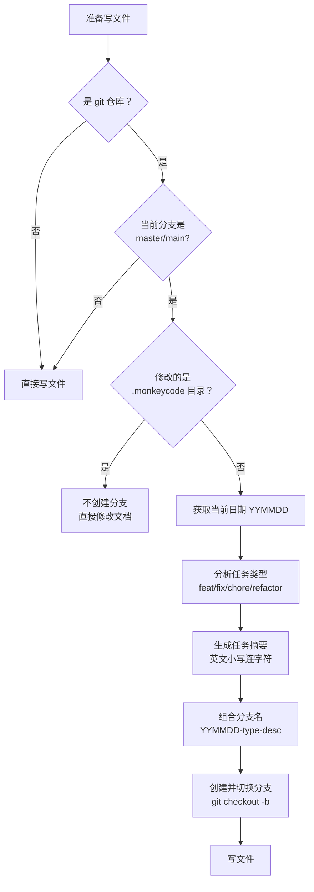
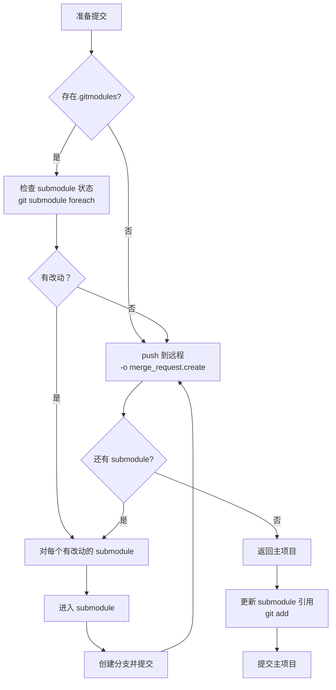
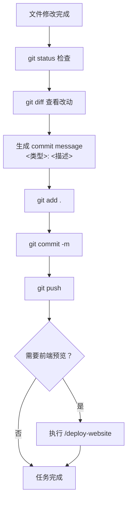
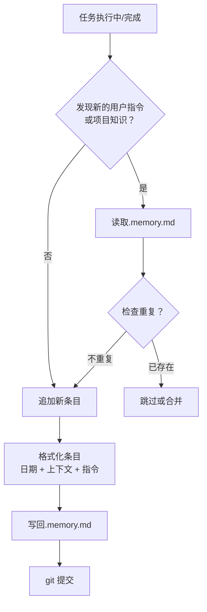

# 方案 D 完整工作流程图

> 版本：v1.0  
> 最后更新：2026-04-30

---

## 主流程图



---

## 子流程详解

### 子流程 1：意图识别与置信度计算



---

### 子流程 2：Skill 触发决策



---

### 子流程 3：分支创建流程（写操作前）



---

### 子流程 4：Git Submodule 处理



---

### 子流程 5：Git 提交流程



---

### 子流程 6：MEMORY.md 更新流程



---

## 完整示例：用户说"帮我复习中级会计"

```mermaid
graph TD
    A["用户：帮我复习中级会计"] --> B[检测否定词 ❌]
    B --> C[关键词匹配<br>"帮我"+"复习"+"中级会计"]
    C --> D[置信度计算<br>一级关键词 100% × 强意图 1.0 = 100%]
    
    D --> E{置信度 ≥80%?}
    E -->|是 | F[直接触发 exam-prep-workflow]
    
    F --> G[读取 skills/exam-prep/SKILL.md]
    G --> H[执行工作流]
    
    H --> I[1. 询问：科目 + 考试日期 + 资料]
    I --> J["用户：中级会计，下周五，有教材"]
    
    J --> K[2. 读取教材/笔记]
    K --> L[3. 提取知识点、重点、公式]
    L --> M[4. 生成文件]
    
    M --> N[创建分支<br>260430-feat-exam-prep]
    N --> O[写文件<br>知识点摘要.md/复习计划.md]
    O --> P[git add + commit + push]
    P --> Q[更新 MEMORY.md<br>记录用户备考偏好]
    Q --> R[任务完成]
```

---

## 触发条件总结表

| 阶段 | 触发条件 | 执行动作 | 输出 |
|------|----------|----------|------|
| **意图识别** | 用户输入包含关键词 | 计算置信度 | skill 名称 + 置信度 |
| **Skill 触发** | 置信度 ≥80% | 直接执行 | 读取完整 skill |
| | 置信度 60-79% | 告知用户 | 读取完整 skill |
| | 置信度 40-59% | 询问确认 | 用户确认后执行 |
| | 置信度 <40% | 不触发 | 正常对话 |
| **分支创建** | 写操作 + master/main 分支 | 创建日期分支 | 新分支 |
| **Submodule** | 存在.gitmodules+ 改动 | 分别提交 push | 更新引用 |
| **Git 提交** | 文件修改完成 | commit + push | 远程仓库 |
| **前端预览** | Web 项目改动 | /deploy-website | 开发服务器 |
| **Memory 更新** | 新指令/知识发现 | 追加条目 | .memory.md |

---

## 关键决策点

| 决策点 | 条件 | 分支 A | 分支 B |
|--------|------|--------|--------|
| 否定词检测 | 包含"不想/不要" | 正常对话 | 继续流程 |
| 置信度阈值 | ≥80% | 直接触发 | 告知/询问 |
| 写操作检查 | 修改文件 | 检查分支 | 直接执行 |
| 分支检查 | master/main | 创建分支 | 当前分支 |
| Submodule 检查 | 存在.gitmodules | 处理 submodule | 直接提交 |
| 前端预览 | Web 项目 | 启动服务 | 直接完成 |

---

## 文件读取优先级

```
1. skills-index.md (常驻) - 技能列表
2. skills-trigger-map.md (常驻) - 关键词映射
3. skills-config.json (常驻) - 配置参数
4. workflows/*.card (按需) - 技能卡片
5. skills/*/SKILL.md (按需) - 完整技能文档
6. .memory.md (常驻) - 用户偏好
```

---

## Token 使用优化

| 文件 | 大小 | 加载策略 | 常驻 Token |
|------|------|----------|-----------|
| CLAUDE.md | ~100 行 | 常驻 | ~1,000 |
| skills-index.md | ~200 行 | 常驻 | ~300 |
| skills-trigger-map.md | ~250 行 | 常驻 | ~300 |
| .memory.md | 可变 | 常驻 | ~100 |
| workflows/*.card | ~40 行×10 | 按需 | 0 |
| skills/*/SKILL.md | ~200 行×88 | 按需 | 0 |
| **总计** | | | **~1,700** |

**对比原方案**：88 个 skill 常驻 ~20,000 tokens → **节省 91.5%**

---

**流程图文档完成时间**：2026-04-30  
**版本**：v1.0
